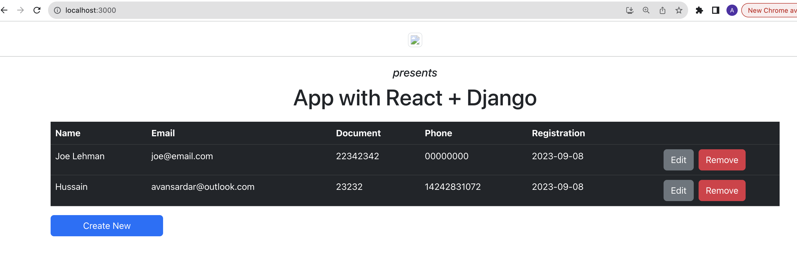
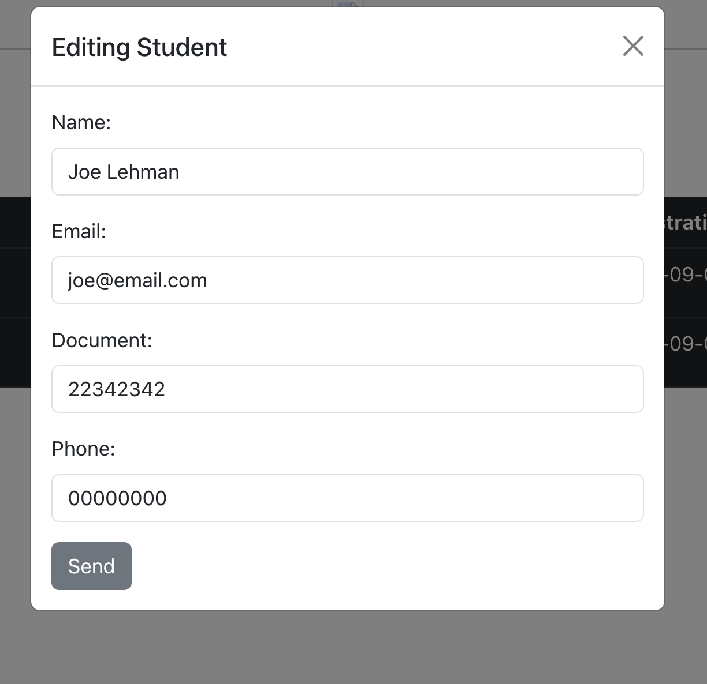
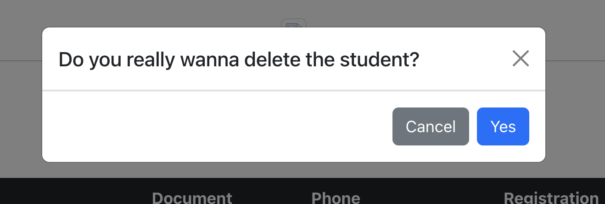

# SEI-05 React Django Boilerplate

Original source: https://blog.logrocket.com/using-react-django-create-app-tutorial/


This is a boilerplate project for setting up a React front-end with a Django back-end. Boilerplate includes a full CRUD on a STUDENT model:






Follow the steps below to get started.


## Getting Started

### 1. Clone the Repository

Clone this project to your local machine outside of any other git repository:

```bash
git clone https://github.com/mujibsardar/sei-05-react-django-boilerplate.git
```

### 2. Set Up a Virtual Environment

For Mac:
```bash
cd sei-05-react-django-boilerplate
```

```bash
source logrocket_env/bin/activate
```

For Windows:
```bash
cd sei-05-react-django-boilerplate
```
```bash
logrocket_env\Scripts\activate
```

### 3. Modify Settings (Optional)
If needed, modify the settings.py file in the react-django directory to add a username and password.

### 4. Apply Migrations
Apply Migrations
Run database migrations:

```bash
python manage.py migrate
```

### 5. Start the Django Server

Make sure you are in the right directory. Same as the manage.py

Start the Django server:

```bash
python manage.py runserver
```
Access the API at http://localhost:8000/api/.


### 6. Start the React App
In a separate terminal window, navigate to the students-fe directory:

```bash
cd students-fe
```

Install Node.js dependencies:
```bash
npm install
```

Start the React app:
```bash
npm run start
```

The React app will be accessible at http://localhost:3000/.


That's it! You now have a working setup for a React front-end with a Django back-end. Happy coding!


###### ONLY IF YOU RUN INTO ENVIROMENT ISSUES DO THIS INSTEAD:

```bash
python3 -m venv logrocket_env
```
then
```bash
source logrocket_env/bin/activate
```