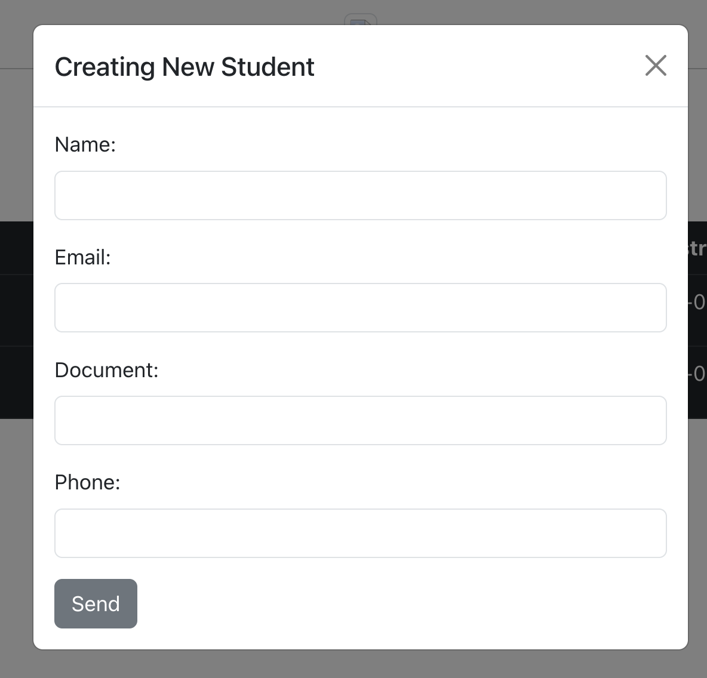

# SEI-05 React Django Boilerplate

Original source: https://blog.logrocket.com/using-react-django-create-app-tutorial/


This is a boilerplate project for setting up a React front-end with a Django back-end. Boilerplate includes a full CRUD on a STUDENT model:





Follow the steps below to get started.


## Getting Started

### 1. Clone the Repository

Clone this project to your local machine outside of any other git repository:

```bash
git clone https://github.com/mujibsardar/sei-05-react-django-boilerplate.git
```

### 2. Set Up a Virtual Environment

For Mac:
```bash
cd sei-05-react-django-boilerplate
```

```bash
source logrocket_env/bin/activate
```
```bash
cd django_react_proj
```

For Windows:
```bash
cd sei-05-react-django-boilerplate
```
```bash
logrocket_env\Scripts\activate
```
```bash
cd django_react_proj
```
### 3. Install Packages
You should getaway with just using python and pip instead pip3 and python3.
```bash
pip install django djangorestframework django-cors-headers
```

### 4. Create DB (if it does not exist) and modify DB info in Settings 
Create DB 
```bash
createdb boilerplate-db
```
If needed, modify the settings.py file in the project directory to use postgres and to add a username and password.

### 5. Apply Migrations
Apply Migrations
Run database migrations in the directory where your manage.py is:

```bash
python manage.py migrate
```

if you run into order conflicts try running the migrations files individually per app. e.g. python manage.py users etc.

### 6. Start the Django Server

Make sure you are in the right directory. Same as the manage.py

Start the Django server:

```bash
python manage.py runserver
```
Access the API at http://localhost:8000/api/.


### 7. Start the React App
In a separate terminal window, navigate to the students-fe directory:

```bash
cd client
```

Install Node.js dependencies:
```bash
npm install
```

Start the React app:
```bash
npm run start
```

The React app will be accessible at http://localhost:3000/.

Don't forget to log out of your virtual enviroment when you are done.

Mac:
```bash
deactivate
```

Windows:
```bash
logrocket_env\Scripts\deactivate
```

That's it! You now have a working setup for a React front-end with a Django back-end. Happy coding!


###### ONLY IF YOU RUN INTO ENVIROMENT ISSUES DO THIS INSTEAD:

Delete the existing logrocket_env directory.

```bash
python3 -m venv logrocket_env
```
then
```bash
source logrocket_env/bin/activate
```

##### DO NOT FORGET TO ASSOCIATE WITH YOUR REPO NOT THE ORIGINAL ONE

In the root of the project delete the .git 

```bash
rm -rf .git
```

then follow the usual git setup instructions...